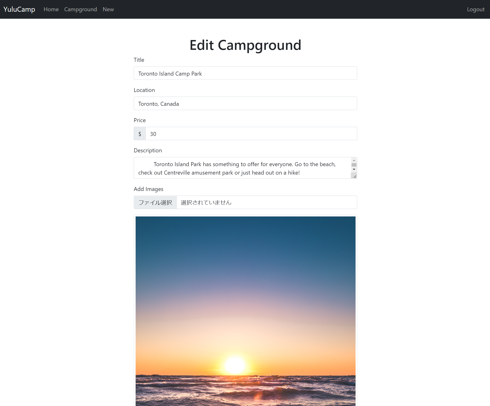

# YuluCamp

YuluCamp is a full-stack Camp Reviewing website project. People can post their own camp sites with prices or can review other's camp sites. YuluCamp was created using Node.js, Express, Bootstrap, and MongoDB.
This is Colt Steele's project from The Web Developer Bootcamp 2021 on Udemy.
## Tech Stacks
- HTML and CSS
- Bootstrap
- EJS
- Node.js
- Express
- MongoDB
- Passport
- Mapbox
- Cloudinary

## Link to Website
### Deployed using Heroke
https://pure-dusk-21602.herokuapp.com/

## Functionalities
> Everyone can view the campgrounds infomation and reviews without login.

>User register with username, email, and password, login with username and password.

>Create new campground

>edit campground

>Cannot manage posts, edit, and delete without being login

>Cannot edit or delete posts and comments created by other users

